<!--
  This is your PROFILE README. It goes in a repo named exactly after your
  username (e.g. github.com/OCTOCAT/OCTOCAT) so GitHub shows it on your profile.
  Widths 370/490 keep the animated portrait and terminal card balanced. If you
  change the generated card height, re-match these display widths.
-->

<table>
<tr>
<td valign="top"></td>
<td valign="top"></td>
</tr>
</table>

## Eswar B

**AI Engineer | Full Stack Developer | Mobile App Developer | Product Builder**

Building practical AI products, mobile applications, and automation tools that solve real-world problems.

[Portfolio](https://eswar.me) / [LinkedIn](https://linkedin.com/in/eswar-balu28) / [Email](mailto:eswarbalu28@gmail.com)

 

<!-- animated contribution graph, refreshed daily by the workflow -->

## Featured Work

**VenueVerse**  
Campus venue and hall booking platform built with React Native, Expo, Supabase, and PostgreSQL. Covers authentication, role-based access, venue and booking management, approval workflows, QR receipt verification, PDF booking receipts, and notifications.

**HireWave**  
AI-assisted campus recruitment platform with React, Node.js, SQLite, Google Gemini, role-based dashboards, job posting, application tracking, resume analysis, and authentication.

**BovineScan**  
AI-powered cattle breed classification and identification platform using computer vision, YOLO, TensorFlow Lite, mobile inference, biometric muzzle recognition, and analytics.

**StudyMate**  
AI learning platform focused on generated study materials, MCQs, backend logic, learning analytics, and a student-focused interface.

**Portfolio Website**  
Personal developer portfolio: [eswar.me](https://eswar.me)

## Focus

Python / JavaScript / Dart / React / React Native / Expo / Flutter / Node.js / Supabase / PostgreSQL / SQLite / Computer Vision / YOLO / TensorFlow Lite / Gemini AI Integration / UI/UX Design
